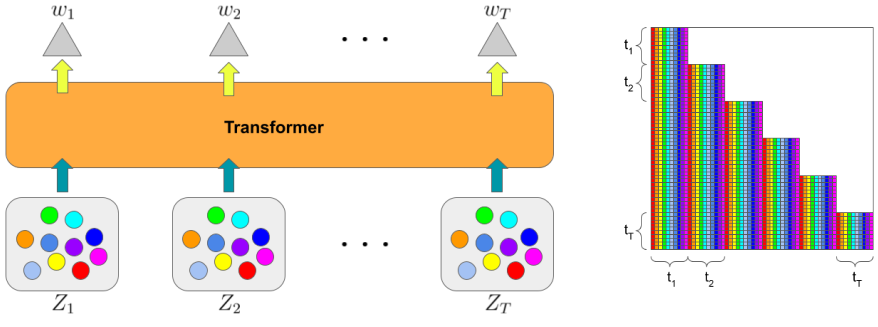
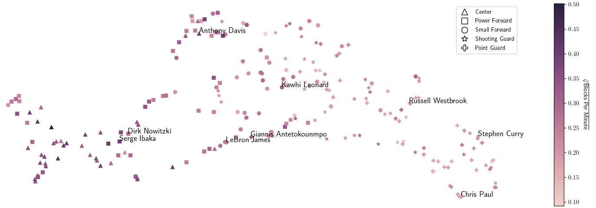
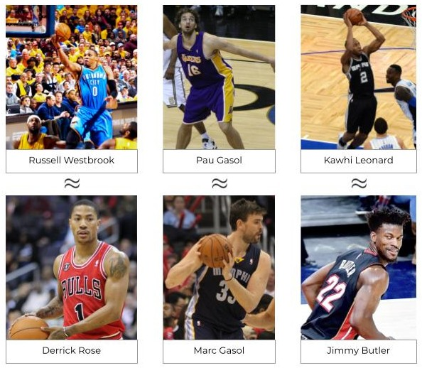
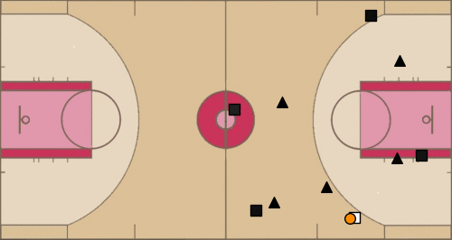
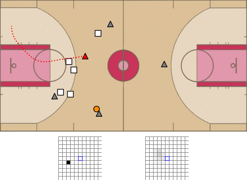

# <code>baller2vec</code>

This is the repository for the paper:

>[Michael A. Alcorn](https://sites.google.com/view/michaelaalcorn) and [Anh Nguyen](http://anhnguyen.me). [`baller2vec`: A Multi-Entity Transformer For Multi-Agent Spatiotemporal Modeling](https://arxiv.org/abs/2102.03291). arXiv. 2021.

|  |
|:--:|
| **Left**: the input for <code>baller2vec</code> at each time step *t* is an *unordered* set of feature vectors containing information about the identities and locations of NBA players on the court. **Right**: <code>baller2vec</code> generalizes the standard Transformer to the multi-entity setting by employing a novel self-attention mask *tensor*. The mask is then reshaped into a matrix for compatibility with typical Transformer implementations. |

|  |
|:--:|
| By exlcusively learning to predict the trajectory of the ball, <code>baller2vec</code> was able to infer idiosyncratic player attributes. |

|  |
|:--:|
| Further, nearest neighbors in <code>baller2vec</code>'s embedding space are plausible doppelgängers. Credit for the images: [Erik Drost](https://en.wikipedia.org/wiki/Russell_Westbrook#/media/File:Russell_Westbrook_shoots_against_Cavs_%28cropped%29.jpg), [Keith Allison](https://en.wikipedia.org/wiki/Pau_Gasol#/media/File:Pau_Gasol_boxout.jpg), [Jose Garcia](https://en.wikipedia.org/wiki/Kawhi_Leonard#/media/File:Kawhi_Leonard_Dunk_cropped.jpg), [Keith Allison](https://en.wikipedia.org/wiki/Derrick_Rose#/media/File:Derrick_Rose_2.jpg), [Verse Photography](https://en.wikipedia.org/wiki/Marc_Gasol#/media/File:Marc_Gasol_20131118_Clippers_v_Grizzles_%28cropped%29.jpg), and [Joe Glorioso](https://en.wikipedia.org/wiki/Jimmy_Butler#/media/File:Jimmy_Butler_%28cropped%29.jpg). |


|  |
|:--:|
| Additionally, several attention heads in <code>baller2vec</code> appear to perform different basketball-relevant functions, such as anticipating passes. Code to generate the GIF was adapted from [@linouk23's NBA Player Movement's repository](https://github.com/linouk23/NBA-Player-Movements). |

|  |
|:--:|
| Here, a <code>baller2vec</code> model trained to simultaneously predict the trajectories of all the players on the court uses both the historical and current context to forecast the target player's trajectory at each time step. The left grid shows the target player's true trajectory at each time step while the right grid shows <code>baller2vec</code>'s forecast distribution. The blue-bordered center cell is the "stationary" trajectory. |

## Citation

If you use this code for your own research, please cite:

```
@article{alcorn2021baller2vec,
   title={baller2vec: A Multi-Entity Transformer For Multi-Agent Spatiotemporal Modeling},
   author={Alcorn, Michael A. and Nguyen, Anh},
   journal={arXiv preprint arXiv:1609.03675},
   year={2021}
}
```

## Training <code>baller2vec</code>

### Setting up `.basketball_profile`

After you've cloned the repository to your desired location, create a file called `.basketball_profile` in your home directory:

```bash
nano ~/.basketball_profile
```

and copy and paste in the contents of [`.basketball_profile`](.basketball_profile), replacing each of the variable values with paths relevant to your environment.
Next, add the following line to the end of your `~/.bashrc`:

```bash
source ~/.basketball_profile
```

and either log out and log back in again or run:

```bash
source ~/.bashrc
```

You should now be able to copy and paste all of the commands in the various instructions sections.
For example:

```bash
echo ${PROJECT_DIR}
```

should print the path you set for `PROJECT_DIR` in `.basketball_profile`.

### Installing the necessary Python packages

```bash
cd ${PROJECT_DIR}
pip3 install --upgrade -r requirements.txt
```

### Organizing the play-by-play and tracking data

1) Copy `events.zip` (which I acquired from [here](https://github.com/sealneaward/nba-movement-data/tree/master/data/events) \[mirror [here](https://github.com/airalcorn2/nba-movement-data/tree/master/data/events)\] using https://downgit.github.io) to the `DATA_DIR` directory and unzip it:

```bash
mkdir -p ${DATA_DIR}
cp ${PROJECT_DIR}/events.zip ${DATA_DIR}
cd ${DATA_DIR}
unzip -q events.zip
rm events.zip
```

Descriptions for the various `EVENTMSGTYPE`s can be found [here](https://github.com/rd11490/NBA_Tutorials/tree/master/analyze_play_by_play) (mirror [here](https://github.com/airalcorn2/NBA_Tutorials/tree/master/analyze_play_by_play)).

2) Clone the tracking data from [here](https://github.com/linouk23/NBA-Player-Movements) (mirror [here](https://github.com/airalcorn2/NBA-Player-Movements)) to the `DATA_DIR` directory:

```bash
cd ${DATA_DIR}
git clone git@github.com:linouk23/NBA-Player-Movements.git
```

A description of the tracking data can be found [here](https://danvatterott.com/blog/2016/06/16/creating-videos-of-nba-action-with-sportsvu-data/).

### Generating the training data

```bash
cd ${PROJECT_DIR}
nohup python3 generate_game_numpy_arrays.py > data.log &
```

You can monitor its progress with:

```bash
top
```

or:

```bash
ls -U ${GAMES_DIR} | wc -l
```

There should be 1,262 NumPy arrays (corresponding to 631 X/y pairs) when finished.

### Animating a sequence

1) If you don't have a display hooked up to your GPU server, you'll need to first clone the repository to your local machine and retrieve certain files from the remote server:

```bash
# From your local machine.
mkdir -p ~/scratch
cd ~/scratch

username=michael
server=gpu3.cse.eng.auburn.edu
data_dir=/home/michael/baller2vec_data
scp ${username}@${server}:${data_dir}/baller2vec_config.pydict .

games_dir=${data_dir}/games
gameid=0021500622

scp ${username}@${server}:${games_dir}/\{${gameid}_X.npy,${gameid}_y.npy\} .
```

2) You can then run this code in the Python interpreter from within the repository (make sure you `source .basketball_profile` first if running locally):

```python
import os

from animator import Game
from settings import DATA_DIR, GAMES_DIR

gameid = "0021500622"
try:
    game = Game(DATA_DIR, GAMES_DIR, gameid)
except FileNotFoundError:
    home_dir = os.path.expanduser("~")
    DATA_DIR = f"{home_dir}/scratch"
    GAMES_DIR = f"{home_dir}/scratch"
    game = Game(DATA_DIR, GAMES_DIR, gameid)

# https://youtu.be/FRrh_WkyXko?t=109
start_period = 3
start_time = "1:55"
stop_period = 3
stop_time = "1:51"
game.show_seq(start_period, start_time, stop_period, stop_time)
```

to generate the following animation:

<p align="center">

</p>

### Running the training script

Run (or copy and paste) the following script, editing the variables as appropriate.

```bash
#!/usr/bin/env bash

# Experiment identifier. Output will be saved to ${EXPERIMENTS_DIR}/${JOB}.
JOB=$(date +%Y%m%d%H%M%S)

# Training options.
echo "train:" >> ${JOB}.yaml
task=ball_traj  # ball_traj, ball_loc, event, player_traj, score, or seq2seq.
echo "  task: ${task}" >> ${JOB}.yaml
echo "  min_playing_time: 0" >> ${JOB}.yaml  # 0/13314/39917/1.0e+6 --> 100%/75%/50%/0%.
echo "  train_valid_prop: 0.95" >> ${JOB}.yaml
echo "  train_prop: 0.95" >> ${JOB}.yaml
echo "  train_samples_per_epoch: 20000" >> ${JOB}.yaml
echo "  valid_samples: 1000" >> ${JOB}.yaml
echo "  workers: 10" >> ${JOB}.yaml
echo "  learning_rate: 1.0e-5" >> ${JOB}.yaml
if [[ ("$task" = "event") || ("$task" = "score") ]]
then
    prev_model=False
    echo "  prev_model: ${prev_model}" >> ${JOB}.yaml
    if [[ "$prev_model" != "False" ]]
    then
        echo "  patience: 5" >> ${JOB}.yaml
    fi
fi

# Dataset options.
echo "dataset:" >> ${JOB}.yaml
echo "  hz: 5" >> ${JOB}.yaml
echo "  secs: 4" >> ${JOB}.yaml
echo "  player_traj_n: 11" >> ${JOB}.yaml
echo "  max_player_move: 4.5" >> ${JOB}.yaml
echo "  ball_traj_n: 19" >> ${JOB}.yaml
echo "  max_ball_move: 8.5" >> ${JOB}.yaml
echo "  n_players: 10" >> ${JOB}.yaml
echo "  next_score_change_time_max: 35" >> ${JOB}.yaml
echo "  n_time_to_next_score_change: 36" >> ${JOB}.yaml
echo "  n_ball_loc_x: 95" >> ${JOB}.yaml
echo "  n_ball_loc_y: 51" >> ${JOB}.yaml
echo "  ball_future_secs: 2" >> ${JOB}.yaml

# Model options.
echo "model:" >> ${JOB}.yaml
echo "  embedding_dim: 20" >> ${JOB}.yaml
echo "  sigmoid: none" >> ${JOB}.yaml
echo "  mlp_layers: [128, 256, 512]" >> ${JOB}.yaml
echo "  nhead: 8" >> ${JOB}.yaml
echo "  dim_feedforward: 2048" >> ${JOB}.yaml
echo "  num_layers: 6" >> ${JOB}.yaml
echo "  dropout: 0.0" >> ${JOB}.yaml
if [[ "$task" != "seq2seq" ]]
then
    echo "  use_cls: False" >> ${JOB}.yaml
    echo "  embed_before_mlp: True" >> ${JOB}.yaml
fi

# Save experiment settings.
mkdir -p ${EXPERIMENTS_DIR}/${JOB}
mv ${JOB}.yaml ${EXPERIMENTS_DIR}/${JOB}/

# Start training the model.
gpu=0
cd ${PROJECT_DIR}
nohup python3 train_baller2vec.py ${JOB} ${gpu} > ${EXPERIMENTS_DIR}/${JOB}/train.log &
```
